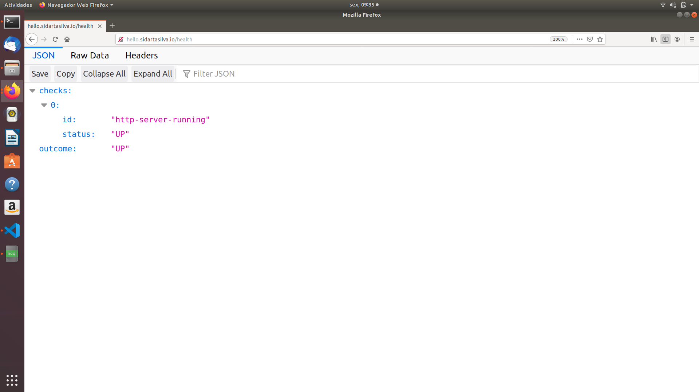
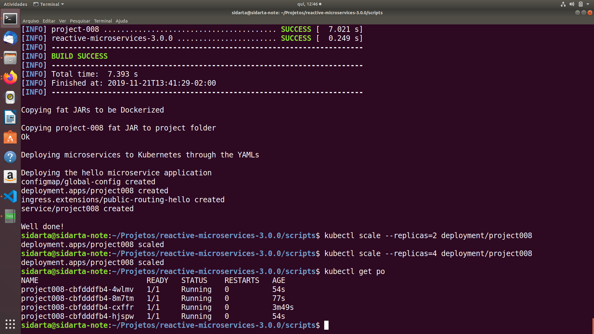
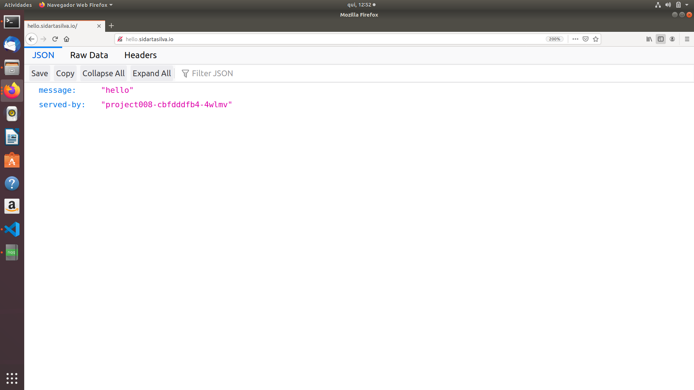

# Building Reactive Microservice Systems

This project is based mainly on the references below.

    ESCOFFIER, C. Building Reactive Microservices in Java Asynchronous and Event-Based Application Design. First Edition. California: O’Reilly Media, Inc., 2017.

    RedHat Developer, accessed 1 November 2019, <https://developers.redhat.com/promotions/building-reactive-microservices-in-java>

    Kubernetes Hands-On - Deploy Microservices to the AWS Cloud 2018, Udemy, accessed 1 November 2019, <https://www.udemy.com/course/kubernetes-microservices>

    <https://github.com/hazelcast/hazelcast-code-samples/>

    <https://vertx.io/docs/vertx-hazelcast>

## Health Check and Failover

In Kubernetes we can declare two types of checks. Readiness checks are used to avoid downtime when updating a microservice. In a rolling update, Kubernetes waits until the new version is ready before shutting down the previous version. It pings the readiness check endpoint of the new microservice until it is ready, and verifies that the microservice has been successfully initialized.

Liveness checks are used to determine whether a Pod is alive. Kubernetes invokes the liveness check endpoint periodically. If a Pod does not reply positively to the check, it will be restarted. A liveness check focuses on the critical resources required by the microservice to behave correctly.

In the following example we will use the same endpoint for both checks. However, it's best to use two different endpoints.

The code of this example is contained in the project-008 diretory. If we open the verticle, we will see the HealthCheck handler verifying whether or not the Http server has been started.

                private boolean started;

                @Override
                public void start() {
                    Router router = Router.router(vertx);

                    router.get("/health").handler(HealthCheckHandler.create(vertx)
                        .register("http-server-running",
                            future -> future.complete(started ? Status.OK() : Status.KO())
                        )
                    );

                    router.get("/").handler(this::hello);

                    router.get("/:name").handler(this::hello);

                    vertx.createHttpServer()
                            .requestHandler(router::accept)
                            .listen(8080, ar -> started = ar.succeeded());

                }

                private void hello(RoutingContext rc) {
                    String message = "hello";
                    
                    if (rc.pathParam("name") != null) {
                        message += " " + rc.pathParam("name");
                    }

                    JsonObject json = new JsonObject()
                            .put("message", message)
                            .put("served-by", System.getenv("HOSTNAME"));

                    rc.response()
                            .putHeader(HttpHeaders.CONTENT_TYPE, "application/json")
                            .end(json.encode());

                }

The Fabric8 Maven plug-in is configured to use /health for the readiness and    liveness health checks. Once this version of the hello microservice is deployed, all subsequent deployments will use the readiness check to avoid downtime.

So let's check the health of our microservice by entering /health in the browser.

As per the status value, we're able to see that the hello microservice is up and running. 

When the Pod is ready, Kubernetes routes the requests to this Pod and shuts down the old one. When we scale up, Kubernetes doesn't route requests to a Pod that is not ready.

So while refreshing the page when we scale the microservice up, we do not get any error about some instance that would not be ready.

